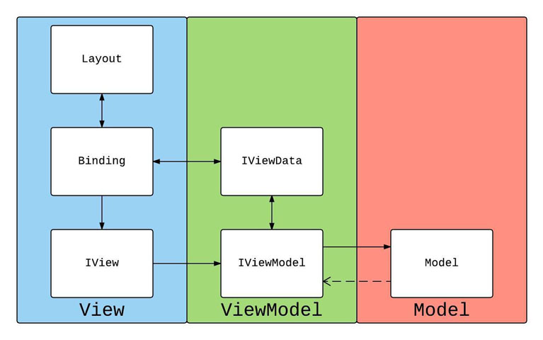
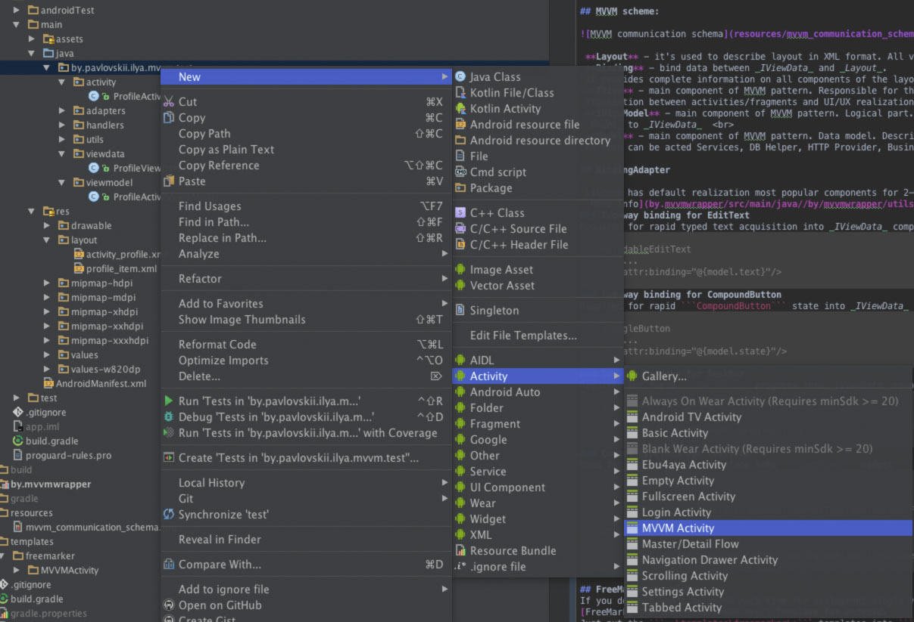

[](https://jitpack.io/#IlyaPavlovskii/Android-MVVM-Wrapper)
# Android MVVM Wrapper.

Package include more specified features of MVVM pattern for Android platform:

1. Two-way binding</br>
2. More @BindingAdapter and @BindingConversion realization</br>
3. RecyclerView adapter binding. RecyclerView.Adapter databinding implementation 

## MVVM scheme:


 
 **Layout** - it's used to describe layout in XML format. All view components are placed here.<br>
 **Binding** - bind data between _IViewData_ and _Layout_. 
 It provides complete information on all components of the layout for View. <br>
 **IView** - main component of MVVM pattern. Responsible for the visual component. All animations, 
 transaction between activities/fragments and UI/UX realization processed by this component.<br> 
 **IViewModel** - main component of MVVM pattern. Logical part. Receive and processing data from 
 _Model_ to _IViewData_  <br> 
 **Model** - main component of MVVM pattern. Data model. Describe fundamentals data for application.
 As then can be acted Services, DB Helper, HTTP Provider, Business logic e.t.c<br>
 
 ## Usage
 Root ```build.gradle```
 ```
 allprojects {
     repositories {
         maven { url 'https://jitpack.io' }
     }
 }
 ```
 Project level ```build.gradle``` 
 ```
 dependencies {
     implementation 'com.github.IlyaPavlovskii:Android-MVVM-Wrapper:2.2.3'
 }
 ```

## Documentation
See the [documentation](https://github.com/IlyaPavlovskii/Android-MVVM-Wrapper/wiki) for examples and general use of MWWMWrapper

## FreeMarker template
If you doesn't wan't to spend much time for deployment single view into your project, you can use
[FreeMarker](http://freemarker.org/) template for android.
Just put the ```..\templates\freemarker\*``` templates into ```..\AndroidStudioFolder\plugins\android\lib\templates\*```



 
Created on the basis of [Fabio Collini tutorial](https://medium.com/@fabioCollini/android-data-binding-f9f9d3afc761).
